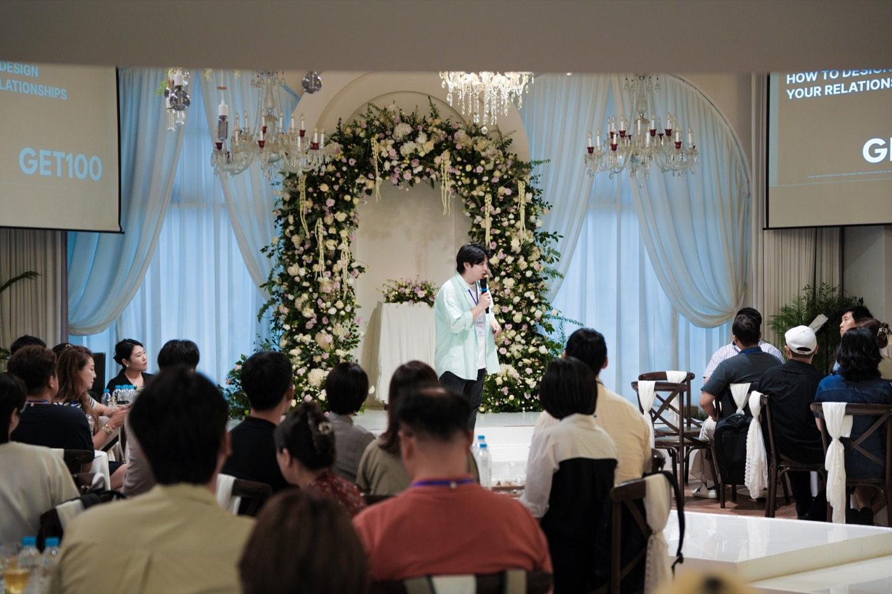
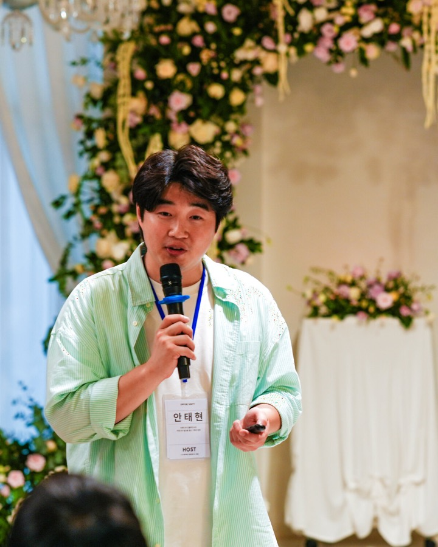

# 안태현 · 밤밤

**커뮤니티 기획자.** 사람을 모으고, 그 안에서 서로 도움이 오가는 구조를 만듭니다.

관계자본 커뮤니티 **[GET100](https://get100.co.kr)**을 6기까지 운영했습니다.
멤버들이 서로의 고객이자 동료가 되는 걸 목표로, 매 기수 선발부터 4주 커리큘럼, 길드 운영까지 제가 합니다.

---

### 지금 하는 일

- **커뮤니티 운영** — GET100 기수 운영, 길드 시스템 설계, 멤버 간 연결
- **커뮤니티 AX** — 커뮤니티 운영을 AI로 자동화합니다. 신청 접수 알림, 회의록 정리, 콘텐츠 발행, 상주 봇까지
- **1:1 자문** — 커뮤니티로 매출을 만들려는 분들과 함께 설계합니다

### 만든 것

**[solo-skills](https://github.com/bam-bam-2/solo-skills)** — 1인 사업가 생산성 키트
직원 없이 49개를 자동화했고, 그중 남이 그대로 쓸 수 있는 스킬 26개를 공개했습니다. 제품 데모 영상, 전자책 PDF, 블로그 글쓰기, 회의록, 카톡 발송.

**[bamalba](https://github.com/bam-bam-2/bamalba)** — AI 에이전트가 스스로 물건을 만들어 파는 과정을 공개 기록으로 남기는 실험

---

### 어떻게 일하나

혼자 하는 일이 많아서, 반복되는 건 전부 에이전트에게 넘깁니다.
매일 자동으로 실행되는 것만 아티클 브리핑 봇, 콘텐츠 발행 파이프라인, 디스코드 상주 봇이 있습니다.

그 과정에서 깨진 것들을 문서로 남기는 편입니다. solo-skills가 그 결과물이에요.

---

### 글

- 블로그 — [blog.naver.com/bam_bam_2](https://blog.naver.com/bam_bam_2)
- 스레드 — [@bam.bam_2](https://www.threads.com/@bam.bam_2)
- 링크드인 — [안태현](https://www.linkedin.com/in/안태현)

### 연락

커뮤니티 기획, 커뮤니티 AX, 협업 제안 모두 환영합니다.
[get100.co.kr](https://get100.co.kr)

